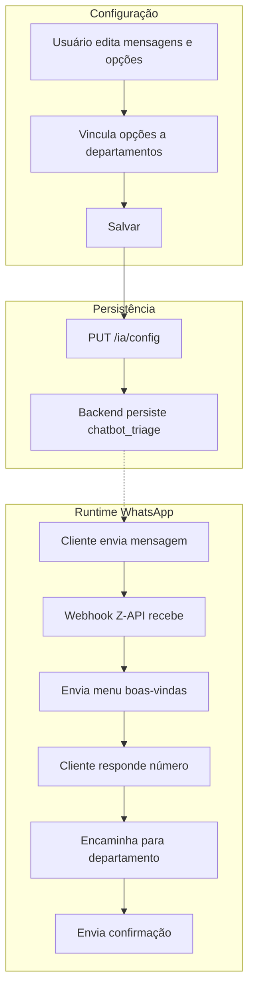

# Especificação — Página de Chatbot de Triagem (ZapERP)

**Versão:** 1.0  
**Última atualização:** Março 2025  
**Status:** Página existente — corrigir, integrar e finalizar

---

## 1. Visão geral

A página de **Chatbot de Triagem** configura o roteador automático de atendimento via webhook Z-API. O usuário define mensagens, opções numéricas e vincula cada opção a um departamento. Quando o cliente envia mensagem no WhatsApp, recebe o menu; ao responder com um número válido, a conversa é encaminhada automaticamente para o departamento correspondente.

**Contexto técnico:** O ZapERP usa apenas Z-API. O chatbot opera via webhook Z-API. A página já existe como aba "Chatbot de Triagem" dentro de IA/Bot (`/ia?tab=chatbot`). O foco é **corrigir o que está quebrado, integrar com os endpoints reais, garantir persistência e manter o padrão visual do ZapERP** — não recriar do zero.

---

## 2. Comportamento esperado

1. O usuário configura a mensagem de boas-vindas.
2. Define as opções do menu (ex.: 1 - Atendimento, 2 - Vendas).
3. Vincula cada opção a um departamento real.
4. Salva a configuração.
5. Quando o cliente envia mensagem no WhatsApp, recebe o menu configurado.
6. Ao responder com um número válido (ex.: "1"), a conversa é encaminhada automaticamente para o departamento correspondente.
7. O cliente recebe a mensagem de confirmação com o nome do setor.

---

## 3. APIs do backend

**Padrão de rotas:** Todas as rotas são relativas à base (`VITE_API_URL`). O ZapERP **não** utiliza prefixo `/api` para estas rotas. O frontend envia `Authorization: Bearer <token>` em todas as requisições.

| Método | Rota | Descrição |
|--------|------|-----------|
| GET | `/ia/config` | Buscar configuração completa (inclui `chatbot_triage`) |
| PUT | `/ia/config` | Salvar configuração (body: `{ chatbot_triage: {...} }`) |
| GET | `/dashboard/departamentos` | Listar departamentos para dropdown |
| GET | `/ia/logs` | Listar logs recentes (params: `limit`) |

### 3.1 Resposta de GET /ia/config

```json
{
  "chatbot_triage": {
    "enabled": false,
    "welcomeMessage": "",
    "invalidOptionMessage": "Opção inválida. Por favor, responda apenas com o número do setor desejado.",
    "confirmSelectionMessage": "Perfeito! Seu atendimento foi direcionado para o setor {{departamento}}. Em instantes nossa equipe dará continuidade.",
    "sendOnlyFirstTime": true,
    "fallbackToAI": false,
    "businessHoursOnly": false,
    "transferMode": "departamento",
    "reopenMenuCommand": "0",
    "options": []
  },
  "bot_global": { ... },
  "roteamento": { ... },
  "ia": { ... },
  "automacoes": { ... }
}
```

### 3.2 Resposta de GET /dashboard/departamentos

Array de objetos: `{ id, nome, company_id }`

### 3.3 Resposta de GET /ia/logs

Array de objetos: `{ id, conversa_id, tipo, detalhes, criado_em }`  
Tipos: `menu_enviado`, `opcao_valida`, `opcao_invalida`, `menu_reenviado`, `erro`

---

## 4. Estrutura da página

### 4.1 Layout

- **Header:** Toggle Ativar/Desativar + título + badge de status
- **Grid:** Formulário à esquerda, preview à direita (empilhado em mobile)
- **Cards:** Mensagens, Comportamento, Opções do menu
- **Logs:** Bloco inferior com lista e botão Atualizar

### 4.2 Componentes obrigatórios

| Componente | Tipo | Campo | Obrigatório |
|------------|------|-------|-------------|
| Toggle Ativar/Desativar | Switch | `enabled` | Sim |
| Mensagem de boas-vindas | Textarea (4–6 linhas) | `welcomeMessage` | Sim (se ativo) |
| Mensagem de opção inválida | Textarea | `invalidOptionMessage` | Sim |
| Mensagem de confirmação | Textarea | `confirmSelectionMessage` — usar `{{departamento}}` | Sim |
| Comando reabrir menu | Input | `reopenMenuCommand` (ex.: "0") | Sim |
| Enviar só na 1ª vez | Checkbox | `sendOnlyFirstTime` | Sim |
| Tabela de opções | Dinâmica | `options` | Sim (se ativo) |
| Botão Salvar | Button | — | Sim |

### 4.3 Componentes recomendados e opcionais

| Componente | Tipo | Descrição |
|------------|------|-----------|
| Preview da conversa | **Recomendado fortemente** | Mostrar exatamente como o cliente verá a mensagem (boas-vindas e confirmação com `{{departamento}}` substituído) |
| Logs recentes | **Opcional na v1** | Exibir eventos do bot; pode ser omitido na primeira versão mesmo que o backend exponha o endpoint |

---

## 5. Validações do frontend

**Obrigatórias antes de salvar:**

- Se `enabled = true`: pelo menos 1 opção válida (label + `departamento_id`)
- Se `enabled = true`: `welcomeMessage` não pode estar vazio
- `key` deve ser única em todas as opções
- Toda opção ativa deve ter `label` e `departamento_id` preenchidos
- Payload deve ser consistente (objeto válido, `options` array)

**Feedback:** Erros de validação devem ser exibidos via toast (não `alert`).

**Correções necessárias na implementação:** O componente `SecaoChatbotTriagem` deve implementar a função `validate()` que retorne string de erro ou `null`, aplicando as regras acima. A função é chamada antes de `onSave`; se retornar string, exibir toast de erro e abortar o salvamento.

---

## 6. Fluxo de dados

1. **Ao carregar:** GET `/ia/config` + GET `/dashboard/departamentos`
2. **Ao salvar:** PUT `/ia/config` com `{ chatbot_triage: { ... } }`
3. **Logs:** GET `/ia/logs?limit=50` (ao abrir aba ou ao clicar em Atualizar)



---

## 7. Exemplo de payload (PUT /ia/config)

O frontend envia apenas a seção alterada. Para o chatbot:

```json
{
  "chatbot_triage": {
    "enabled": true,
    "welcomeMessage": "Olá! Seja bem-vindo(a)...\n\n1 - Atendimento\n2 - Vendas\n\nResponda com o número da opção desejada.",
    "invalidOptionMessage": "Opção inválida. Por favor, responda apenas com o número do setor desejado.",
    "confirmSelectionMessage": "Perfeito! Seu atendimento foi direcionado para o setor {{departamento}}. Em instantes nossa equipe dará continuidade.",
    "sendOnlyFirstTime": true,
    "fallbackToAI": false,
    "businessHoursOnly": false,
    "transferMode": "departamento",
    "reopenMenuCommand": "0",
    "options": [
      { "key": "1", "label": "Atendimento", "departamento_id": 1, "active": true },
      { "key": "2", "label": "Vendas", "departamento_id": 2, "active": true }
    ]
  }
}
```

**Campos a preservar no payload:** `fallbackToAI`, `businessHoursOnly`, `transferMode` — usar valores padrão se não editáveis na UI.

---

## 8. Estrutura de `options`

Cada item de `options` deve conter:

| Campo | Tipo | Descrição |
|-------|------|-----------|
| `key` | string | Número da opção (ex.: "1", "2") |
| `label` | string | Nome exibido (ex.: "Atendimento") |
| `departamento_id` | number | ID do departamento vinculado |
| `active` | boolean | Se a opção está ativa |

---

## 9. Pré-requisitos

- Z-API conectada (instância em `empresa_zapi`)
- Departamentos cadastrados em Configurações
- Usuários vinculados aos departamentos (`departamento_id`)

---

## 10. Rota da página

- **Principal:** `/ia?tab=chatbot`
- **Alternativa:** `/configuracoes/chatbot` → redireciona para `/ia?tab=chatbot`

---

## 11. Integração com backend real

A tela deve estar 100% conectada ao backend:

- **Carregar configuração salva** ao abrir a página
- **Carregar departamentos reais** do endpoint
- **Salvar sem quebrar o JSON** — enviar payload válido com todos os campos esperados
- **Refletir a configuração persistida** após reload da página
- **Exibir feedback de sucesso** (toast) ao salvar
- **Exibir feedback de erro** (toast ou banner) em caso de falha

---

## 12. Checklist final de certificação (Z-API)

### Backend

- [ ] `WHATSAPP_PROVIDER=zapi` no .env
- [ ] `empresa_zapi` com registro ativo: `company_id`, `instance_id`, `instance_token`, `client_token`, `ativo=true`
- [ ] Webhook Z-API configurado: `{APP_URL}/webhooks/zapi?token={ZAPI_WEBHOOK_TOKEN}`
- [ ] GET `/ia/config` retorna `chatbot_triage`
- [ ] PUT `/ia/config` persiste `chatbot_triage` corretamente
- [ ] Departamentos cadastrados
- [ ] Usuários com `departamento_id` vinculado

### Frontend

- [ ] Página carrega config e departamentos ao abrir
- [ ] Toggle Ativar/Desativar funcional
- [ ] Mensagens editáveis e persistidas
- [ ] Tabela de opções: adicionar, editar, remover
- [ ] Dropdown de departamentos populado
- [ ] Validações obrigatórias antes de salvar (função `validate()` implementada)
- [ ] Salvar persiste e exibe feedback de sucesso/erro
- [ ] Configuração refletida após reload
- [ ] Logs exibidos (se endpoint disponível)
- [ ] Preview da mensagem (recomendado)

### Teste ponta a ponta

1. Ativar chatbot com pelo menos 1 opção válida
2. Salvar configuração
3. Enviar mensagem do WhatsApp para o número conectado
4. Verificar recebimento do menu de boas-vindas
5. Responder com número da opção (ex.: "1")
6. Verificar: conversa vinculada ao departamento, confirmação enviada
7. Verificar: conversa aparece para usuários do departamento no CRM
